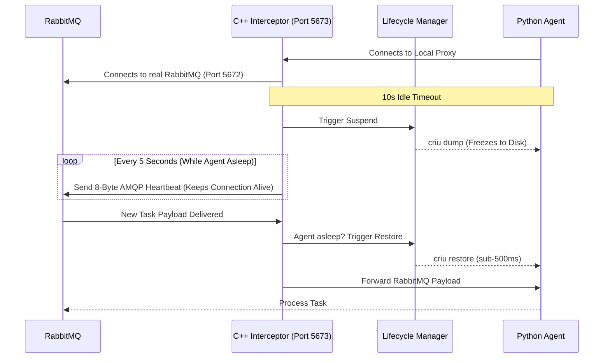

# Phantom Process Supervisor

> **High-density, sub-millisecond serverless runtime for AI environments.**

The Phantom Process Supervisor is a custom backend infrastructure designed to solve the **Cold Start** problem in serverless functions. By leveraging CRIU (Checkpoint/Restore In Userspace), it "freezes" idle AI agents to disk instead of terminating them, and seamlessly restores them upon the next incoming request.

**SentinelARC Integration**: This version of Phantom Supervisor has been specifically adapted for **AMQP (RabbitMQ) architectures**.

## 🚀 Key Results
- **10x Memory Density**: Run 10x more agents on the same hardware by evicting idle processes from RAM.
- **< 500 ms Restore Time**: Sub-millisecond wake-up compared to traditional multi-second Docker/VM cold starts.
- **Zero Connection Drops**: A custom C++ proxy intercepts and holds client connections open, specifically injecting fake AMQP heartbeats to RabbitMQ while the backend agent is resurrected.

## 🧠 Why It Matters
For modern AI and MLOps platforms, spinning up containerized agents (Cold Starts) is expensive—both in latency and compute. This architecture allows companies to scale to thousands of on-demand AI agents securely and cost-effectively, maintaining instant availability from the user's perspective while freeing idle infrastructure.

## 🏗️ Architecture (AMQP Implementation)

## ⏱️ How it Works

1. **Active State**: The Python agent connects to the C++ Proxy (5673), which proxies directly to RabbitMQ (5672).
2. **Trigger Suspend**: After 10 seconds of inactivity, the proxy triggers `criu dump`, freezing the agent to disk, reducing RAM usage to zero.
3. **Heartbeat Injection**: While the agent is frozen, the C++ Proxy continuously injects fake AMQP heartbeats to RabbitMQ so RabbitMQ does not drop the connection.
4. **Instantly Restore**: When RabbitMQ pushes a new task to the socket, the Proxy holds the payload, resurrects the agent with `criu restore`, and immediately pipes the data to the thawed agent!

## 📂 Documentation
Deep architectural explanations and code overviews can be found in our [`docs/`](./docs) folder:
- [Detailed Project Documentation](./docs/Project_Documentation.md)
- [Code Explanation](./docs/Code_Explanation.md)
- [Phantom Supervisor Integration](../../Phantom_Supervisor_Integration.md)
